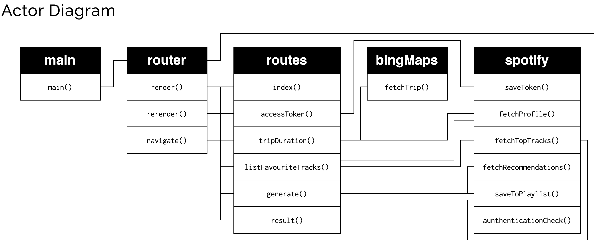
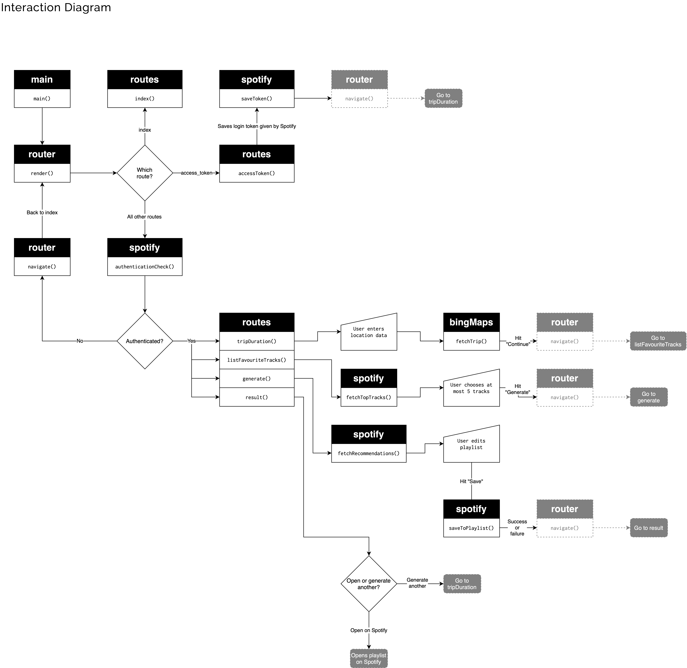

# Web App From Scratch @cmda-minor-web 2020 - 2021

[](https://github.com/theonejonahgold/web-app-from-scratch-2021/blob/master/LICENSE) [](https://github.com/theonejonahgold/web-app-from-scratch-2021/issues) [](https://triptop.app) [](shields.io)

[Link to live version](https://triptop.app)

A web app built from scratch giving you a Spotify playlist that is the perfect length for your trip.

## Index

- [Getting started](#getting-started)
- [Folder structure](#folder-structure)
- [APIs used](#apis-used)
- [Features](#features)
- [User Interaction Flow](#user-interaction-flow)
- [Design patterns used](#design-patterns-used)

## Getting started

Before you get started, I advice you to read the [APIs used](#apis-used) section, as you need a Client ID for Spotify as well as an API key for Mapquest.

This project doesn't use any bundlers or dev servers. I would advice you to install [Browsersync](https://www.npmjs.com/package/browser-sync) to serve the web content in this project. You install Browsersync either through [NPM](https://www.npmjs.com), [Yarn](https://yarnpkg.com) or any other NPM package manager of choice with global installation functionality.

```shell
$ npm install --global browser-sync || yarn global add browser-sync
```

Then proceed to clone this repository.

```shell
$ git clone https://github.com/theonejonahgold/web-app-from-scratch-2021 web-app
$ cd web-app
$ browser-sync -w -s --port 5000 # Starts a browser-sync server on port 5000 that watches for file changes in the current directory
```

## Folder structure

- **scripts**: Where all JavaScript goes
  - **constants**: Constant values, like API URIs and keys.
  - **helpers**: Functions used in specific use cases, like the Spotify or Bing Maps API.
  - **modules**: Function compisitions applicable in multiple projects. They're separated over files named after their main concern, e.g. objects.
  - **routes**: Route functions used in this app.
  - **stores**: Stores created for this app.
  - **utils**: Single-purpose functions that can be used on their own or combined. They're separated over files named after their main concern.
  - **main.js**: The start of the application
- **styles**: Where all CSS goes
  - **main.css**: Where all the styling comes together.
- **templates**: Where all Handlebars templates live.
- **assets**: For images and other types of media assets.
- **index.html**: The entrypoint for the application.

## APIs used

The APIs used both have API keys. You can put these inside the constants folder, where all constant values reside.

### [Spotify Web API](https://developer.spotify.com/documentation/web-api/)

The Spotify API is extremely expansive. From user information to the devices they can connect to, from artists to recommendations based on a certain song and artist. You can grab almost everything from this API, without any explicit rate limits.

[This page](https://developer.spotify.com/documentation/general/guides/app-settings/#register-your-app) gives you information on how to create a Spotify Application on the Developer Platform.

If you have created one, be sure to set the redirect URIs to 'http://localhost:5000' and the URL you are hosting this app on.

### [Mapquest Directions API](https://developer.mapquest.com/documentation/directions-api/route/get/)

The Mapquest API is quite large, and has a lot of features related to mapping. We are only using the Directions API to see how long a trip takes.

This API has a rate limit of 150000 per month before you've got to pony up, so keep that in mind.

Create an account [here](https://developer.mapquest.com/user/register) and get your API key from the dashboard.

## Features

- [x] A feature list
- [x] Log in to Spotify
- [x] Search addresses
- [x] Get estimated time for a trip
- [x] Choose songs from top songs for seeding
- [x] Save playlist
- [x] Swap songs from recommended playlist
- [x] Preview songs
- [x] Beautiful design
- [ ] Change length of trip

## actor diagram



## Interaction diagram



## Design patterns used

- Pure functional pattern
- PubSub pattern
- Composition pattern
- Hash routing
